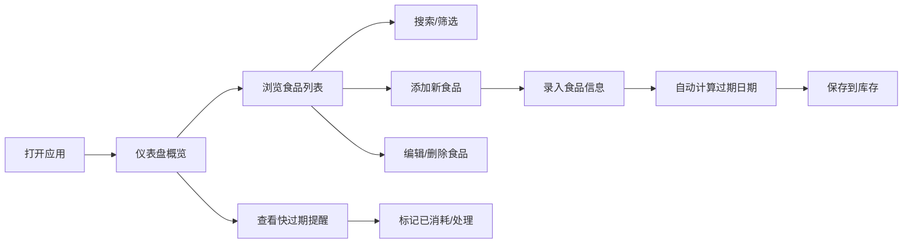

# 食品保质期管理应用 - 产品需求文档

## 1. 产品概述
鲜尝提醒是一款家庭食品库存与保质期管理工具，帮助用户追踪家中食品的新鲜度，避免食物过期浪费，节省开支。
- 核心目标：解决家庭食品过期浪费问题，让用户一目了然地掌握家中食品状态
- 目标用户：关注家庭饮食健康、希望减少食物浪费的家庭用户
- 产品价值：减少食物浪费 = 省钱 + 环保 + 健康饮食

## 2. 核心功能

### 2.1 用户角色
| 角色 | 注册方式 | 核心权限 |
|------|----------|----------|
| 普通用户 | 无需注册，本地使用 | 食品录入、查看、编辑、删除、过期提醒 |

### 2.2 功能模块
1. **仪表盘**：统计概览、快过期提醒、分类统计
2. **食品库存**：食品列表、搜索筛选、排序、状态标签
3. **食品管理**：添加食品、编辑食品、删除食品、批量操作
4. **过期提醒**：即将过期预警、已过期标识、提醒设置

### 2.3 页面详情
| 页面名称 | 模块名称 | 功能描述 |
|----------|----------|----------|
| 仪表盘 | 统计卡片 | 显示总食品数、即将过期数、已过期数、分类数量 |
| 仪表盘 | 快过期提醒 | 按过期时间排序展示即将过期的食品Top列表 |
| 仪表盘 | 分类概览 | 按食品品类展示库存分布 |
| 食品列表 | 搜索筛选 | 按名称搜索、按状态筛选、按分类筛选 |
| 食品列表 | 排序功能 | 按过期时间、购买时间、名称排序 |
| 食品列表 | 食品卡片 | 展示食品图片/图标、名称、保质期状态、数量、开封状态 |
| 添加/编辑食品 | 表单录入 | 食品名称、品类、购买日期、生产日期、保质期、数量、是否开封、备注 |
| 添加/编辑食品 | 快捷录入 | 常用品类快速选择、保质期预设 |
| 食品详情 | 详情展示 | 完整食品信息、过期倒计时、操作历史 |
| 设置 | 提醒设置 | 提前提醒天数设置、通知开关 |

## 3. 核心流程

用户打开应用 → 查看仪表盘了解食品整体状态 → 点击快过期食品查看详情 → 决定食用或处理
新购食品 → 点击添加按钮 → 录入食品信息 → 保存到库存 → 系统自动计算过期时间
管理库存 → 浏览食品列表 → 搜索/筛选特定食品 → 编辑/删除/标记已消耗

## 4. 用户界面设计

### 4.1 设计风格
- **设计方向**：清新自然、温暖健康的有机风格
- **主色调**：清新绿色系（代表新鲜、健康），搭配暖橙色（提醒、警示）
- **辅助色**：柔和的米色背景，给人温馨厨房的感觉
- **按钮风格**：圆角胶囊形按钮，柔和阴影，悬停微放大效果
- **字体**：圆润友好的无衬线字体，标题使用有特色的展示字体
- **布局风格**：卡片式布局，柔和圆角，轻盈阴影
- **图标风格**：简洁线性图标，配合emoji增加亲和力

### 4.2 配色方案
- 主色：#22c55e（新鲜绿）
- 警示色：#f97316（即将过期-橙）
- 危险色：#ef4444（已过期-红）
- 背景色：#fefce8（暖米黄）
- 卡片色：#ffffff
- 文字主色：#1f2937
- 文字次色：#6b7280

### 4.3 页面设计概览
| 页面名称 | 模块名称 | UI元素 |
|----------|----------|--------|
| 仪表盘 | 顶部问候 | 日期显示、欢迎语、设置按钮 |
| 仪表盘 | 统计卡片 | 四宫格统计卡片，带图标和数字，渐变色背景 |
| 仪表盘 | 快过期区域 | 横向滚动卡片列表，过期倒计时动画 |
| 仪表盘 | 分类统计 | 彩色分类标签，数量徽标 |
| 食品列表 | 搜索栏 | 圆角搜索框，带清除按钮 |
| 食品列表 | 筛选标签 | 横向滚动的状态/分类筛选标签 |
| 食品列表 | 食品卡片网格 | 响应式网格布局，卡片悬停上浮效果 |
| 食品卡片 | 状态标识 | 右上角角标（新鲜/即将过期/已过期），不同颜色 |
| 添加食品 | 悬浮按钮 | 右下角圆形加号按钮，渐变背景 |
| 添加食品 | 表单弹窗 | 底部滑出表单，分步录入，进度指示 |

### 4.4 响应式设计
- 桌面端优先设计，适配平板和手机
- 桌面端：3-4列卡片网格
- 平板端：2列卡片网格
- 手机端：单列卡片，底部导航
- 触摸优化：按钮最小44px，足够间距

### 4.5 动效设计
- 页面加载：卡片渐入动画，错落延迟
- 悬停效果：卡片轻微上浮，阴影加深
- 添加成功：成功动效，数字滚动
- 过期状态：呼吸灯效果提醒
- 切换页面：平滑过渡动画
