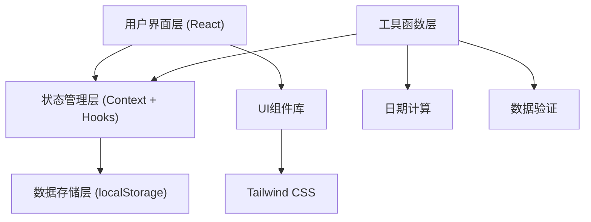
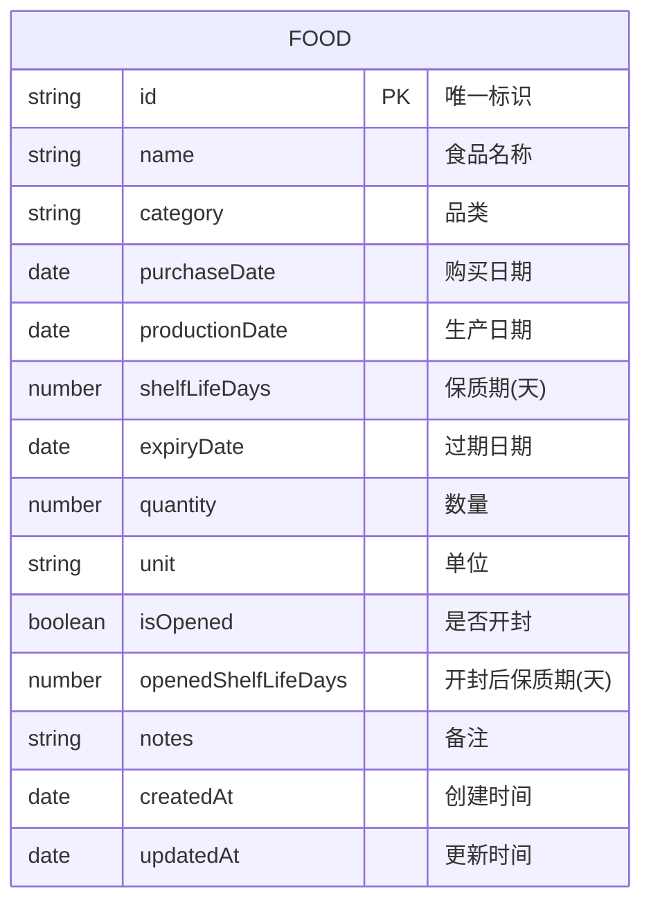

# 食品保质期管理应用 - 技术架构文档

## 1. 架构设计



## 2. 技术描述

- **前端框架**：React@18 + TypeScript
- **构建工具**：Vite@5
- **样式方案**：Tailwind CSS@3
- **路由管理**：React Router DOM@6
- **图标库**：Lucide React
- **状态管理**：React Context + useReducer
- **数据持久化**：localStorage
- **动画方案**：CSS Transitions + Framer Motion

## 3. 目录结构

```
src/
├── components/          # 通用组件
│   ├── layout/         # 布局组件
│   ├── food/           # 食品相关组件
│   ├── ui/             # 基础UI组件
│   └── modals/         # 弹窗组件
├── context/            # Context 状态管理
├── hooks/              # 自定义 Hooks
├── pages/              # 页面组件
├── types/              # TypeScript 类型定义
├── utils/              # 工具函数
├── data/               # 静态数据/预设数据
├── App.tsx
├── main.tsx
└── index.css
```

## 4. 路由定义

| 路由 | 页面 | 说明 |
|------|------|------|
| / | 仪表盘 | 统计概览、快过期提醒 |
| /inventory | 食品库存 | 食品列表、搜索筛选 |
| /add | 添加食品 | 添加新食品表单 |
| /food/:id | 食品详情 | 食品详情与编辑 |
| /settings | 设置 | 提醒设置、偏好设置 |

## 5. 数据模型

### 5.1 数据模型定义



### 5.2 TypeScript 类型定义

```typescript
interface FoodItem {
  id: string;
  name: string;
  category: FoodCategory;
  purchaseDate: string;
  productionDate?: string;
  shelfLifeDays: number;
  expiryDate: string;
  quantity: number;
  unit: string;
  isOpened: boolean;
  openedShelfLifeDays?: number;
  notes?: string;
  createdAt: string;
  updatedAt: string;
}

type FoodCategory = 
  | '蔬菜水果'
  | '肉禽蛋'
  | '海鲜水产'
  | '乳制品'
  | '粮油调味'
  | '零食饮料'
  | '冷冻食品'
  | '方便速食'
  | '其他';

type FoodStatus = 'fresh' | 'expiring-soon' | 'expired';

interface AppSettings {
  warningDays: number;
  notificationsEnabled: boolean;
}
```

## 6. 核心功能模块

### 6.1 食品状态计算
- 根据过期日期计算剩余天数
- 剩余天数 > 提醒阈值：新鲜状态
- 剩余天数 ≤ 提醒阈值且 > 0：即将过期
- 剩余天数 ≤ 0：已过期
- 开封食品按开封后保质期重新计算

### 6.2 数据持久化
- 使用 localStorage 存储食品数据
- 数据变更时自动同步到 localStorage
- 应用启动时从 localStorage 加载数据
- 提供数据导入/导出功能（JSON格式）

### 6.3 过期提醒
- 应用启动时检查即将过期的食品
- 桌面通知（如浏览器支持）
- 仪表盘醒目展示快过期食品
- 可配置提前提醒天数

## 7. 核心工具函数

| 函数名 | 功能 | 参数 | 返回值 |
|--------|------|------|--------|
| calculateExpiryDate | 计算过期日期 | 生产日期/购买日期, 保质期天数 | Date |
| getDaysUntilExpiry | 获取剩余天数 | 过期日期 | number |
| getFoodStatus | 获取食品状态 | 过期日期, 提醒天数 | FoodStatus |
| generateId | 生成唯一ID | - | string |
| formatDate | 格式化日期 | Date, 格式 | string |
